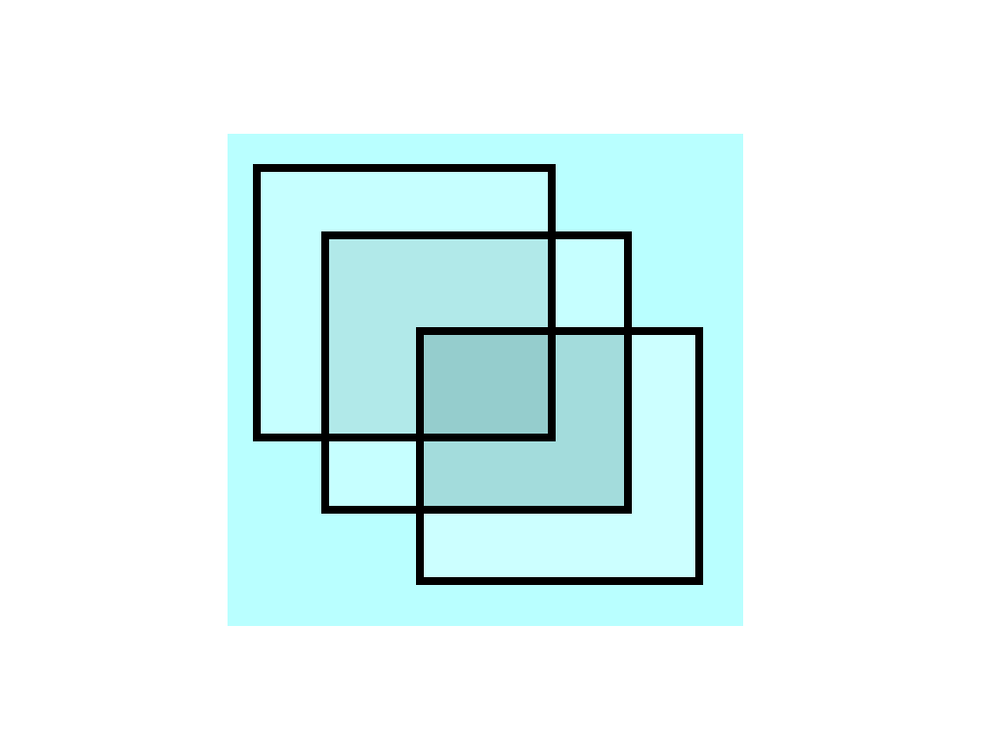

<div align="center">



<h1>🎨 Layered</h1>
<p><b>Modern Python image &amp; game-asset editor</b></p>
<p>Real-time canvas · Non-destructive layers · Plugin-powered workflow</p>

<!-- Hero Badges -->
<p>
<a href="https://github.com/NightHawkHSI/Layered/releases/latest">
  
</a>


</p>

<!-- Quick Actions -->
<p>
<a href="https://github.com/NightHawkHSI/Layered/releases/latest">
  
</a>
<a href="https://github.com/NightHawkHSI/Layered/issues/new?labels=bug">
  
</a>
<a href="https://github.com/NightHawkHSI/Layered/issues/new?labels=enhancement">
  
</a>
<a href="docs/PLUGIN_API.md">
  
</a>
</p>

<!-- Stats -->
<p>


</p>

</div>

---

## Table of Contents

- [What is Layered?](#what-is-layered)
- [Features](#features)
- [Quick Start](#quick-start)
- [Bundled Plugins](#bundled-plugins)
- [Project Structure](#project-structure)
- [Writing a Plugin](#writing-a-plugin)
- [Blend Modes](#blend-modes)
- [Logging &amp; Crash Reports](#logging--crash-reports)
- [Building a Standalone EXE](#building-a-standalone-exe)
- [Contributing](#contributing)
- [License](#license)

---

## What is Layered?

Layered is an open-source image and game-asset editor built in Python with PyQt6, inspired by Paint.NET. It gives you a familiar non-destructive workflow — draw, stack layers, blend, export — without leaving your Python toolchain.

It's purpose-built for **game asset creation**: export every layer as its own PNG with a `manifest.json` carrying offsets, blend modes, and visibility, so your engine can reassemble them at runtime.

---

## Features

### 🎨 Drawing toolkit
Brush, eraser, fill bucket, line, rectangle, ellipse, color picker, text — paint assets from scratch or retouch imports.

### 🗂 Non-destructive layers
- Per-layer opacity and visibility toggle
- **9 blend modes** — Normal, Multiply, Screen, Overlay, Darken, Lighten, Add, Subtract, Difference
- Reorder, rename, duplicate, group
- Original pixel data is never destroyed — every operation is reversible

### ↶ Full undo / history
Every brush stroke, filter, and layer op is tracked. Browse history in the side panel and jump to any prior state.

### 📦 Export
- Flattened composite as PNG / JPEG / WEBP
- **Per-layer PNG export** with `manifest.json` (offsets, blend modes, visibility, opacity) — drop straight into a game engine
- Multi-project tabs — work on several files at once

### 🔌 Plugin system
Drop a `.py` file into `Plugins/`. Plugins can register **tools, filters, or menu actions**, declare typed settings (the host auto-builds a settings dialog), and run sandboxed — a crashing plugin gets logged and isolated, the editor stays alive.

### 📋 Logging &amp; crash reports
- `logs/layered.log` — full session activity
- `logs/errors/` — per-crash reports with stack trace + context
- In-app console panel mirrors log output live

---

## Quick Start

```bash
# 1. Clone
git clone https://github.com/NightHawkHSI/Layered.git
cd Layered

# 2. Install dependencies
pip install -r requirements.txt

# 3. Run
python main.py
```

**Requirements:** Python 3.9+, `PyQt6 >= 6.6`, `Pillow >= 10.0`, `numpy >= 1.26`.

> Prefer not to install Python? Grab the prebuilt Windows release from the [Releases page](https://github.com/NightHawkHSI/Layered/releases/latest).

---

## Bundled Plugins

Layered ships with 17 working plugins in `Plugins/` — use them as-is or read the source as a template:

| Plugin | Type | What it does |
|---|---|---|
| `grayscale` | Filter | Desaturate to grayscale |
| `invert` | Filter | Invert RGB / per-channel |
| `brightness_contrast` | Filter | Brightness + contrast sliders |
| `sharpen` | Filter | Unsharp mask |
| `posterize` | Filter | Reduce color levels |
| `gradient_map` | Filter | Remap luminance to gradient |
| `color_replace` | Filter | Swap one color for another |
| `outline_filter` | Filter | Edge outline |
| `glow_filter` | Filter | Soft outer glow |
| `drop_shadow` | Filter | Drop shadow with offset / blur |
| `normal_map` | Filter | Generate normal map from height |
| `background_remove` | Filter | Knock out flat / chroma background |
| `tile_fix` | Filter | Make texture seamless |
| `pixel_art_resize` | Filter | Nearest-neighbor upscale |
| `crop_tool` | Action | Crop canvas to selection |
| `flip_tool` | Action | Flip horizontal / vertical |
| `grid_overlay` | Action | Toggle grid overlay |

---

## Project Structure

```
Layered/
├── main.py                    # Entry point
├── requirements.txt
├── build.bat                  # PyInstaller one-file build (Windows)
├── Icon.png / Icon.ico
├── app/
│   ├── main_window.py         # Menus, docks, plugin wiring
│   ├── canvas.py              # Interactive canvas widget
│   ├── layer.py               # Layer + LayerStack
│   ├── blending.py            # Blend-mode math (NumPy)
│   ├── tools.py               # Built-in drawing tools
│   ├── image_ops.py           # Pixel ops (fill, transforms, etc.)
│   ├── history.py             # Undo / redo stack
│   ├── project.py             # Project file (.layered) save/load
│   ├── session.py             # Multi-document session state
│   ├── export.py              # Composite + per-layer export
│   ├── plugin_api.py          # Public plugin API (Plugin, Setting, ctx)
│   ├── plugin_loader.py       # Plugin discovery + sandbox
│   ├── logger.py              # Logging + crash reporter
│   └── ui/                    # Qt panels (layers, tools, color, history,
│                              #   text, console, project tabs, dialogs)
├── Plugins/                   # Drop your plugins here
├── docs/
│   └── PLUGIN_API.md          # Full plugin API reference
└── logs/                      # Generated at runtime
```

---

## Writing a Plugin

Drop a `.py` file in `Plugins/` and subclass `Plugin`:

```python
# Plugins/my_filter.py
from PIL import Image, ImageOps
from app.plugin_api import Plugin, PluginContext


class GrayscalePlugin(Plugin):
    name = "Grayscale"
    version = "1.0.0"

    def register(self, ctx: PluginContext) -> None:
        ctx.register_filter("Grayscale", self.apply)

    @staticmethod
    def apply(image: Image.Image) -> Image.Image:
        return ImageOps.grayscale(image.convert("RGB")).convert("RGBA")
```

A plugin can register three surfaces:

| Kind | Where it shows up | Method |
|---|---|---|
| **Tool** | Toolbox button | `ctx.register_tool(name, Tool)` |
| **Filter** | `Filters` menu | `ctx.register_filter(name, fn, settings=...)` |
| **Action** | `Plugins` menu | `ctx.register_action(name, fn, settings=...)` |

Filters and actions can declare typed `Setting` specs (`int`, `float`, `bool`, `choice`, `color`, `string`) — the host auto-builds a dialog and passes values as keyword arguments. See [`docs/PLUGIN_API.md`](docs/PLUGIN_API.md) for the full surface and the bundled `invert.py` for a settings example.

---

## Blend Modes

| Mode | Effect |
|---|---|
| Normal | Standard alpha compositing |
| Multiply | Darkens — good for shadows |
| Screen | Lightens — good for glows |
| Overlay | Contrast boost (multiply + screen) |
| Darken | Keep the darker pixel |
| Lighten | Keep the lighter pixel |
| Add | Brighten additively (linear dodge) |
| Subtract | Darken subtractively |
| Difference | Highlight where layers differ |

All modes operate on premultiplied RGBA via NumPy in `app/blending.py`.

---

## Logging &amp; Crash Reports

| File | Contents |
|---|---|
| `logs/layered.log` | Full session activity, INFO+ |
| `logs/errors/<timestamp>.txt` | Stack trace + context per crash |
| In-app **Console** panel | Live mirror of the log stream |

Plugins get their own sandboxed logger (`layered.plugin.<name>`) — use `ctx.logger` instead of `print` so output lands in both the file and the console panel.

---

## Building a Standalone EXE

Windows one-file build via PyInstaller:

```bash
build.bat
```

Output drops in `dist/`. The bundled `Plugins/` and `Icon.ico` are picked up automatically.

---

## Contributing

1. Fork the repo and create a branch: `git checkout -b feature/my-thing`
2. Make changes — keep functions small, prefer Pillow / NumPy over hand-rolled loops
3. Run the app, verify nothing regressed
4. Open a PR with a clear description of **what** changed and **why**

Bug reports and feature requests live in [Issues](https://github.com/NightHawkHSI/Layered/issues).

---

## License

See [LICENSE](LICENSE).

<div align="center">

Made with Python · <a href="docs/PLUGIN_API.md">Plugin API</a> · <a href="https://github.com/NightHawkHSI/Layered/issues">Issues</a> · <a href="https://github.com/NightHawkHSI/Layered/releases">Releases</a>

</div>
