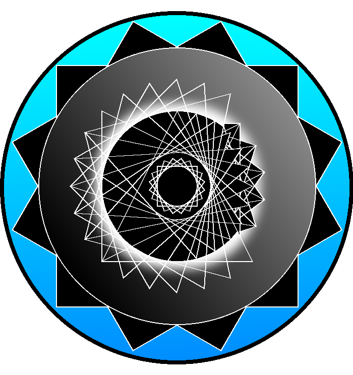

<div align="center">

<br/>



<br/>

# LAYERED

### Modern Python image & game-asset editor

*Real-time canvas · Non-destructive layers · Plugin-powered workflow*

<br/>

[](https://github.com/NightHawkHSI/Layered/releases/latest)
[](https://python.org)
[](https://pypi.org/project/PyQt6/)
[](LICENSE)

<br/>

[](https://github.com/NightHawkHSI/Layered/releases/latest)
[](https://github.com/NightHawkHSI/Layered/issues/new?labels=bug)
[](https://github.com/NightHawkHSI/Layered/issues/new?labels=enhancement)
[](docs/PLUGIN_API.md)

<br/>


[](https://github.com/NightHawkHSI/Layered)

</div>

<br/>


<br/>

---

## 📖 Table of Contents

| | |
|---|---|
| [🖼 What is Layered?](#-what-is-layered) | [🧩 Blend Modes](#-blend-modes) |
| [✨ Features](#-features) | [🪵 Logging & Crash Reports](#-logging--crash-reports) |
| [🚀 Quick Start](#-quick-start) | [📦 Building a Standalone EXE](#-building-a-standalone-exe) |
| [🔌 Bundled Plugins](#-bundled-plugins) | [🤝 Contributing](#-contributing) |
| [🗂 Project Structure](#-project-structure) | [📄 License](#-license) |
| [✍️ Writing a Plugin](#️-writing-a-plugin) | [🖌 Brush Presets & Custom Tools](#-brush-presets--custom-tools) |

---

## 🖼 What is Layered?

**Layered** is an open-source image and game-asset editor built in Python with PyQt6, inspired by Paint.NET. It delivers a familiar non-destructive workflow — draw, stack layers, blend, export — without ever leaving your Python toolchain.

> **Built for game developers.** Export every layer as its own PNG alongside a `manifest.json` carrying offsets, blend modes, and visibility — so your engine can reassemble the scene at runtime.

---

## ✨ Features

<details open>
<summary><b>🎨 Drawing Toolkit</b></summary>
<br/>

Brush · Eraser · Fill Bucket · Line · Rectangle · Ellipse · Color Picker · Text

Paint assets from scratch or retouch imports with a full suite of drawing primitives.

</details>

<details open>
<summary><b>🗂 Non-Destructive Layers</b></summary>
<br/>

- Per-layer **opacity** and **visibility** toggle
- **9 blend modes** — Normal, Multiply, Screen, Overlay, Darken, Lighten, Add, Subtract, Difference
- Reorder, rename, duplicate, and group layers
- Original pixel data is **never** destroyed — every operation is fully reversible

</details>

<details open>
<summary><b>↶ Full Undo / History</b></summary>
<br/>

Every brush stroke, filter, and layer operation is tracked. Browse the history panel and jump to any prior state instantly.

</details>

<details open>
<summary><b>📦 Export Formats</b></summary>
<br/>

| Format | Description |
|---|---|
| **PNG / JPEG / WEBP** | Flattened composite export |
| **Per-layer PNG + `manifest.json`** | Offsets, blend modes, visibility, opacity — game-engine ready |
| **Multi-tab Projects** | Work on several files simultaneously |

</details>

<details open>
<summary><b>🔌 Plugin System</b></summary>
<br/>

Drop a `.py` file into `Plugins/` and it's live. Plugins can register **tools, filters, or menu actions**, declare typed settings (auto-generated dialog), and run fully sandboxed — a crashing plugin gets logged and isolated while the editor keeps running.

</details>

<details open>
<summary><b>📋 Logging & Diagnostics</b></summary>
<br/>

- `logs/layered.log` — full session activity
- `logs/errors/` — per-crash reports with stack trace + context
- In-app **Console** panel mirrors log output live

</details>

---

## 🚀 Quick Start

```bash
# 1. Clone the repo
git clone https://github.com/NightHawkHSI/Layered.git
cd Layered

# 2. Install dependencies
pip install -r requirements.txt

# 3. Launch
python main.py
```

**Requirements:** Python `3.9+` · `PyQt6 >= 6.6` · `Pillow >= 10.0` · `numpy >= 1.26`

> 💡 **No Python?** Grab the prebuilt Windows binary from the [Releases page](https://github.com/NightHawkHSI/Layered/releases/latest) — no setup needed.

---

## 🔌 Bundled Plugins

Layered ships with **17+ working plugins** in `Plugins/` — ready to use or read as templates.

| Plugin | Type | Description |
|---|:---:|---|
| `grayscale` | 🔵 Filter | Desaturate to grayscale |
| `invert` | 🔵 Filter | Invert RGB / per-channel |
| `brightness_contrast` | 🔵 Filter | Brightness + contrast sliders |
| `sharpen` | 🔵 Filter | Unsharp mask sharpening |
| `posterize` | 🔵 Filter | Reduce color levels |
| `gradient_map` | 🔵 Filter | Remap luminance to a gradient |
| `color_replace` | 🔵 Filter | Swap one color for another |
| `outline_filter` | 🔵 Filter | Edge outline effect |
| `glow_filter` | 🔵 Filter | Soft outer glow |
| `drop_shadow` | 🔵 Filter | Drop shadow with offset & blur |
| `normal_map` | 🔵 Filter | Generate normal map from height |
| `background_remove` | 🔵 Filter | Knock out flat / chroma background |
| `tile_fix` | 🔵 Filter | Make textures seamless |
| `pixel_art_resize` | 🔵 Filter | Nearest-neighbor upscale |
| `crop_tool` | 🟠 Action | Crop canvas to selection |
| `flip_tool` | 🟠 Action | Flip horizontal / vertical |
| `grid_overlay` | 🟠 Action | Toggle grid overlay |

---

## 🗂 Project Structure

```
Layered/
├── 📄 main.py                    # Entry point
├── 📄 requirements.txt
├── 📄 build.bat                  # PyInstaller one-file build (Windows)
├── 🖼 Icon.png / Icon.ico
│
├── 📁 app/
│   ├── main_window.py            # Menus, docks, plugin wiring
│   ├── canvas.py                 # Interactive canvas widget
│   ├── layer.py                  # Layer + LayerStack
│   ├── blending.py               # Blend-mode math (NumPy)
│   ├── tools.py                  # Tool base class + ToolContext + drawing helpers
│   ├── tool_loader.py            # Tool discovery from Plugins/Brushes/<Group>/<Tool>/
│   ├── brush_loader.py           # Brush-preset discovery from Brushes/
│   ├── image_ops.py              # Pixel ops (fill, transforms, etc.)
│   ├── history.py                # Undo / redo stack
│   ├── project.py                # .layered project save/load
│   ├── session.py                # Multi-document session state
│   ├── export.py                 # Composite + per-layer export
│   ├── plugin_api.py             # Public plugin API
│   ├── plugin_loader.py          # Plugin discovery + sandbox
│   ├── logger.py                 # Logging + crash reporter
│   └── 📁 ui/                   # Qt panels (layers, tools, color, history,
│                                 #   text, console, project tabs, dialogs)
│
├── 📁 Plugins/                   # ← Drop your plugins here
│   └── Brushes/                  #     Tool plugins, grouped by folder
│       └── <Group>/              #     Group becomes a split-button in the Tools dock
│           └── <Tool>/
│               ├── tool.py       # Required — defines TOOL_CLASS = MyTool
│               └── tool.json     # Optional manifest (display name, category override)
│   │   ├── Paint/                #   Brush · Eraser · Fill · Gradient
│   │   ├── Draw/                 #   Line · Rectangle · Ellipse
│   │   ├── Shapes/               #   Triangle · Star · Pentagon · Diamond · Hexagon
│   │   ├── Lines/                #   Arrow · Curve · Dashed Line
│   │   ├── Custom Brushes/       #   Spray · Square Brush · Scatter  ← drag & drop here
│   │   ├── Select/               #   Lasso · Marquee · Magic Wand · Sel Transform
│   │   ├── Effects/              #   Blur · Sharpen · Smudge · Clone Stamp
│   │   ├── Transform/            #   Move · Transform
│   │   ├── Text/                 #   Text
│   │   └── Utility/              #   Picker
├── 📁 Brushes/                   # ← Brush presets (size/hardness/opacity/...)
├── 📁 docs/
│   └── PLUGIN_API.md             # Full plugin API reference
└── 📁 logs/                      # Generated at runtime
```

---

## ✍️ Writing a Plugin

Drop a `.py` file in `Plugins/` and subclass `Plugin` — that's it.

```python
# Plugins/my_filter.py
from PIL import Image, ImageOps
from app.plugin_api import Plugin, PluginContext


class GrayscalePlugin(Plugin):
    name    = "Grayscale"
    version = "1.0.0"

    def register(self, ctx: PluginContext) -> None:
        ctx.register_filter("Grayscale", self.apply)

    @staticmethod
    def apply(image: Image.Image) -> Image.Image:
        return ImageOps.grayscale(image.convert("RGB")).convert("RGBA")
```

### Registration Surfaces

| Kind | Where it appears | Method |
|---|---|---|
| **Tool** | Toolbox panel | `ctx.register_tool(name, Tool)` |
| **Filter** | `Filters` menu | `ctx.register_filter(name, fn, settings=...)` |
| **Action** | `Plugins` menu | `ctx.register_action(name, fn, settings=...)` |

Filters and actions accept typed `Setting` specs — `int`, `float`, `bool`, `choice`, `color`, `string` — and the host auto-generates the settings dialog, passing values as keyword arguments.

📘 See [`docs/PLUGIN_API.md`](docs/PLUGIN_API.md) for the full API surface and `invert.py` for a complete settings example.

---

## 🖌 Brush Presets & Custom Tools

Tools and brush presets live in two separate trees:

| Folder | Drives | Layout |
|---|---|---|
| `Plugins/Brushes/` | The **Tools dock** — every group folder becomes a split-button with its sub-tools in a dropdown | `<Group>/<Tool>/tool.py` |
| `Brushes/` | The **brush preset picker** — preset JSON files per category | `<Category>/<preset>.json` |

### Adding a brush preset

```json
// Brushes/Inking/04_marker.json
{ "name": "Marker", "icon": "🖊", "size": 20, "hardness": 0.95, "opacity": 1.0, "spacing": 0.05 }
```

### Drag-and-drop custom tools

The `Plugins/Brushes/Custom Brushes/` folder is designed for user-created tools — just **drag a new folder in** and it appears in the tool panel on next launch. No registration, no config.

```text
Plugins/Brushes/
└── Custom Brushes/          ← drop your tool folder here
    ├── Spray/
    │   └── tool.py
    ├── Square Brush/
    │   └── tool.py
    ├── Scatter/
    │   └── tool.py
    └── YourTool/            ← copy this pattern
        └── tool.py          ← only file required
```

See `Plugins/Brushes/Custom Brushes/HOW_TO_ADD_TOOLS.md` for a full walkthrough with copy-paste templates for both simple tools and shape tools with resize handles.

### Adding a custom tool (minimal template)

```python
# Plugins/Brushes/Paint/Marker/tool.py
from app.tools import Tool
from app.layer import Layer

class MarkerTool(Tool):
    name = "Marker"
    commit_on = "release"   # "press" | "release" | None

    def press(self, layer: Layer, x: int, y: int) -> None:
        pass

    def move(self, layer: Layer, x: int, y: int) -> None:
        pass

    def release(self, layer: Layer, x: int, y: int) -> None:
        super().release(layer, x, y)   # required

TOOL_CLASS = MarkerTool
```

```python
# tool.py
from PIL import ImageDraw
from app.tools import Tool


class MarkerTool(Tool):
    name = "Marker"
    is_default = False                # set True to make this the boot-time tool

    def on_select(self, ctx): ...      # called when this tool becomes active
    def on_deselect(self, ctx): ...    # called just before another tool takes over

    def on_mouse_down(self, ctx, x, y): ...   # mouse press
    def on_mouse_drag(self, ctx, x, y): ...   # mouse move while held
    def on_mouse_up  (self, ctx, x, y): ...   # mouse release

    def build_ui(self, parent, ctx):
        """Return a QWidget hosted in the tool-settings toolbar.
        The previous tool's widget is destroyed before this is called.
        Return None if the tool needs no settings UI."""
        return None


TOOL_CLASS = MarkerTool
```

Optional `tool.json` lets a tool override its display name or category:

```json
{ "name": "✏️ Marker", "category": "Paint" }
```

Discovery is automatic on launch — no registration code, no menu wiring. The folder structure builds the UI:

```text
Plugins/Brushes/
├── Paint/          →  [ Paint ▼ ]          Brush · Eraser · Fill · Gradient
├── Draw/           →  [ Draw ▼ ]           Line · Rectangle · Ellipse
├── Shapes/         →  [ Shapes ▼ ]         Triangle · Star · Pentagon · Diamond · Hexagon
├── Lines/          →  [ Lines ▼ ]          Arrow · Curve · Dashed Line
├── Custom Brushes/ →  [ Custom Brushes ▼ ] Spray · Square Brush · Scatter
├── Select/         →  [ Select ▼ ]         Lasso · Marquee · Magic Wand · Sel Transform
├── Effects/        →  [ Effects ▼ ]        Blur · Sharpen · Smudge · Clone Stamp
├── Transform/      →  [ Transform ▼ ]      Move · Transform
├── Text/           →  [ Text ▼ ]           Text
└── Utility/        →  [ Utility ▼ ]        Picker
```

---

## 🧩 Blend Modes

| Mode | Effect | Best For |
|---|---|---|
| **Normal** | Standard alpha compositing | Everything |
| **Multiply** | Darkens — multiplies values | Shadows, tinting |
| **Screen** | Lightens — inverts multiply | Glows, highlights |
| **Overlay** | Contrast boost (multiply + screen) | Detail enhancement |
| **Darken** | Keeps the darker pixel | Soft shadows |
| **Lighten** | Keeps the lighter pixel | Soft highlights |
| **Add** | Brightens additively (linear dodge) | Bloom, fire, neon |
| **Subtract** | Darkens subtractively | Dark burn effects |
| **Difference** | Highlights where layers differ | Masking, debug |

> All modes operate on **premultiplied RGBA** via NumPy in `app/blending.py`.

---

## 🪵 Logging & Crash Reports

| Location | Contents |
|---|---|
| `logs/layered.log` | Full session activity, INFO+ |
| `logs/errors/<timestamp>.txt` | Stack trace + context per crash |
| In-app **Console** panel | Live mirror of the log stream |

Plugins get their own sandboxed logger (`layered.plugin.<name>`) — use `ctx.logger` instead of `print` so output lands in both the log file and the console panel.

---

## 📦 Building a Standalone EXE

Windows one-file build via PyInstaller:

```bash
build.bat
```

Output drops in `GitHub/Release/`. The bundled `Plugins/`, `Brushes/`, and `Icon.ico` folders are picked up automatically.

---

## 🤝 Contributing

1. **Fork** the repo and create a branch: `git checkout -b feature/my-thing`
2. **Make changes** — keep functions small, prefer Pillow / NumPy over hand-rolled loops
3. **Test** — run the app and verify nothing regressed
4. **Open a PR** with a clear description of *what* changed and *why*

Bug reports and feature requests live in [Issues](https://github.com/NightHawkHSI/Layered/issues). All contributions are welcome!

---

## 📄 License

Distributed under the terms described in [LICENSE](LICENSE).

---

<div align="center">

<br/>

**Built with Python · Powered by PyQt6 & Pillow**

<br/>

[](docs/PLUGIN_API.md)
[](https://github.com/NightHawkHSI/Layered/issues)
[](https://github.com/NightHawkHSI/Layered/releases)

<br/>

*If Layered saved you time, consider leaving a ⭐ — it helps others find the project!*

</div>
